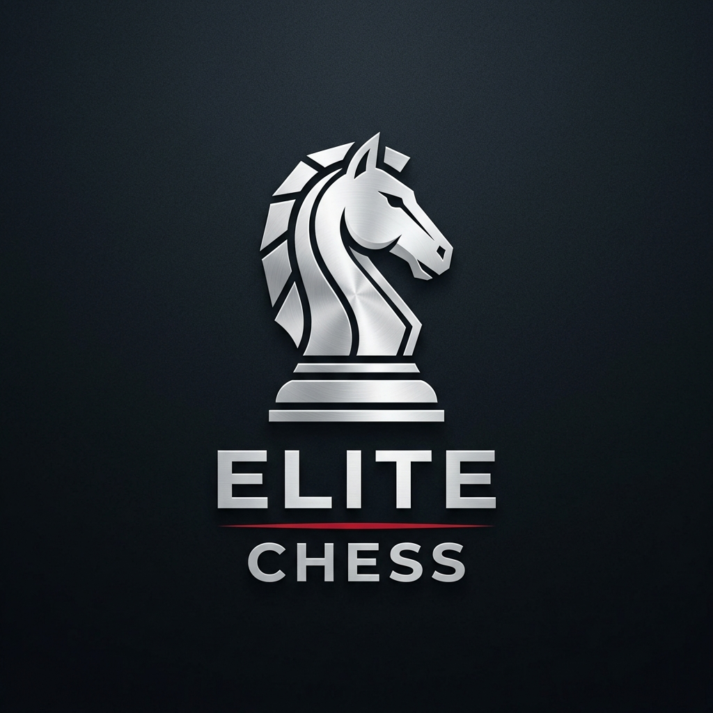

# ♟️ Elite Chess Tournament Manager

**Elite Chess**, FIDE standartlarına tam uyumlu, modern arayüzlü ve canlı yayın destekli bir satranç turnuva yönetim yazılımıdır. 70+ oyunculu kalabalık turnuvaları bile hatasız ve profesyonel bir şekilde yönetmek için tasarlanmıştır.



## 🚀 Öne Çıkan Özellikler

*   **FIDE Dutch-Swiss Eşlendirme Motoru:** Recursive Backtracking algoritması ile güçlendirilmiş, puan grubu düşüşlerini (floater) minimize eden ve FIDE C.04.1.b standartlarına %100 uyumlu eşleştirme.
*   **📡 Canlı Yayın Sistemi:** Cloudflare Tunnel ve localhost.run entegrasyonu sayesinde tek tıkla turnuva sonuçlarını internette (Web üzerinden) canlı yayınlama.
*   **🎨 Modern Kullanıcı Arayüzü:** Karanlık (Dark), Aydınlık (Light) ve Modern Koyu temalarla göz yormayan, premium bir deneyim.
*   **📊 Gelişmiş Eşitlik Bozma:** TSF 2025 standartlarına uygun; Buchholz (C1), Sonneborn-Berger, Galibiyet Sayısı gibi sistemlerin tam desteği.
*   **📥 FIDE XML Entegrasyonu:** FIDE'nin güncel reyting listelerini XML formatında içe aktarma ve oyuncu arama.
*   **📑 Dışa Aktarma:** Turnuva tablolarını ve sonuçları Excel (.xlsx) veya HTML formatında profesyonel raporlar olarak kaydetme.

## 🛠️ Kurulum

Projeyi yerel makinenizde çalıştırmak için:

1.  Depoyu klonlayın:
    ```bash
    git clone https://github.com/emircca/Elite-Chess-Manager.git
    cd Elite-Chess-Manager
    ```
2.  Gerekli kütüphaneleri yükleyin:
    ```bash
    pip install -r requirements.txt
    ```
3.  Uygulamayı başlatın:
    ```bash
    python main.py
    ```

## 📦 EXE Olarak Derleme

Uygulamayı tek bir `.exe` dosyası haline getirmek için projenin kök dizinindeki `build.bat` dosyasını çalıştırmanız yeterlidir. Derlenen dosya `dist/` klasörü altına oluşturulacaktır.

## ⚙️ Gereksinimler

*   Python 3.8+
*   PyQt6
*   Openpyxl (Excel çıktıları için)
*   Cloudflared (Opsiyonel, canlı yayın için)

## ⚖️ Lisans

Bu proje **GNU GPLv3** lisansı ile lisanslanmıştır. Daha fazla bilgi için [LICENSE](LICENSE) dosyasına göz atabilirsiniz.

## ✍️ Geliştirici

Bu proje **Emir Cica** tarafından tasarlanmış ve geliştirilmiştir.

---
*Elite Chess Tournament Manager - Satrançta Profesyonellik.*
